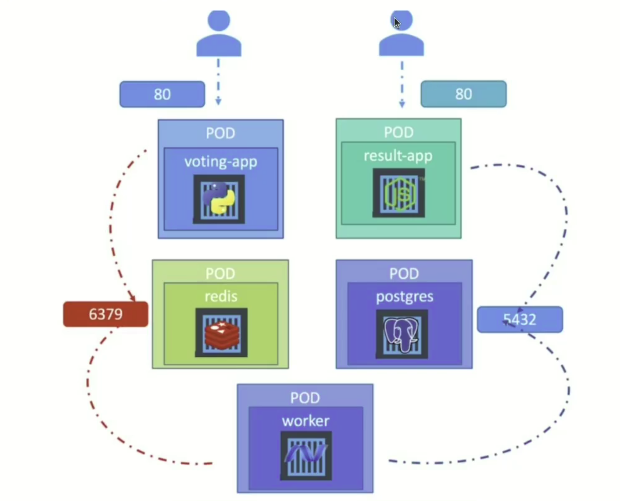

# Microservices with Kubernetes

Here's a sample of the power of Kubernetes.

### Architecture


### Pods



### Build

Run `sh init.sh build`

### List Pods, Services and Deployments

```bash
# Running "kubectl get all -n vote", you should expect this

bruno@debian:~/www/kubernetes/microservices$ kubectl get all -n vote
NAME                             READY   STATUS              RESTARTS   AGE
pod/postgresql-cf5697695-whwv7   0/1     ContainerCreating   0          13s
pod/redis-66949686f7-2plpj       1/1     Running             0          13s
pod/result-7c68c895d7-b5p4m      1/1     Running             0          13s
pod/vote-6c59456cc-tgvnm         0/1     ContainerCreating   0          13s
pod/worker-86f8f864d-gh9lq       0/1     ContainerCreating   0          13s

NAME                 TYPE        CLUSTER-IP       EXTERNAL-IP   PORT(S)          AGE
service/postgresql   ClusterIP   10.97.119.162    <none>        5432/TCP         52s
service/redis        ClusterIP   10.97.7.86       <none>        6379/TCP         52s
service/result       NodePort    10.104.152.157   <none>        5001:31001/TCP   52s
service/vote         NodePort    10.105.45.115    <none>        5000:31000/TCP   52s

NAME                         READY   UP-TO-DATE   AVAILABLE   AGE
deployment.apps/postgresql   0/1     1            0           13s
deployment.apps/redis        1/1     1            1           13s
deployment.apps/result       1/1     1            1           13s
deployment.apps/vote         0/1     1            0           13s
deployment.apps/worker       0/1     1            0           13s

NAME                                   DESIRED   CURRENT   READY   AGE
replicaset.apps/postgresql-cf5697695   1         1         0       13s
replicaset.apps/redis-66949686f7       1         1         1       13s
replicaset.apps/result-7c68c895d7      1         1         1       13s
replicaset.apps/vote-6c59456cc         1         1         0       13s
replicaset.apps/worker-86f8f864d       1         1         0       13s

```

### Gather URL

`minikube service result --url -n vote`

### Usage

https://github.com/user-attachments/assets/c8f37fd5-500a-470c-9dfc-0799d718f683

